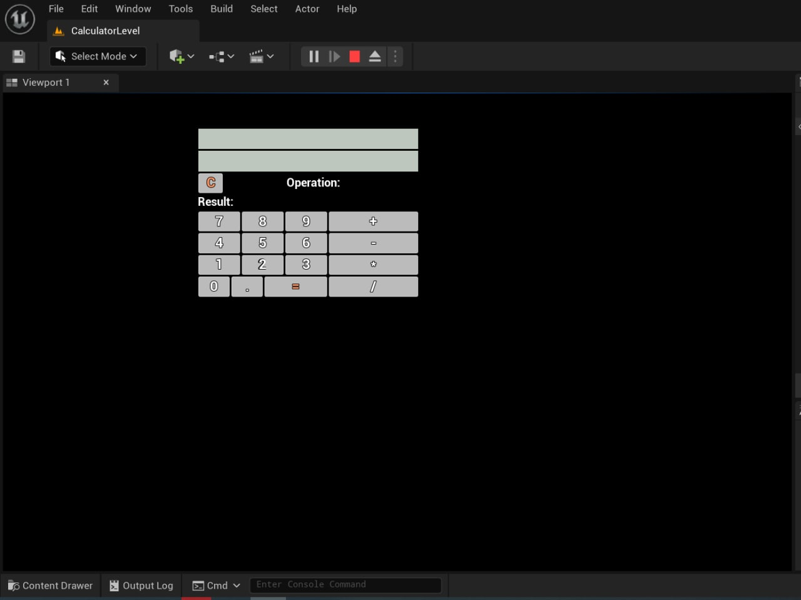
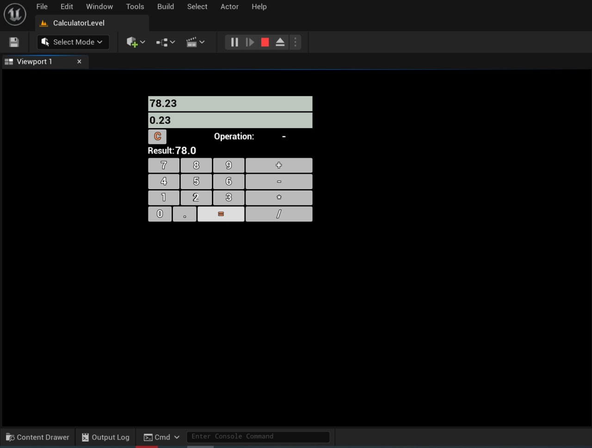

# UE5.0.2 Practical Task C++and Blueprints Connection

Practice task: 
Write a custom UE4 plugin which will add custom methods for Blueprints. (Using С++, C#, Editor, Blueprints). 

For example:

1 - Make a simple menu: with Blueprints (input field and a button) and with C++ (button triggers entered to be written into a file)

2 – Make a simple calculator (+,-,*,/) UI - in  Blueprints; – calculations - in С++.

## My solution is provided in Content\MyCalculator folder

