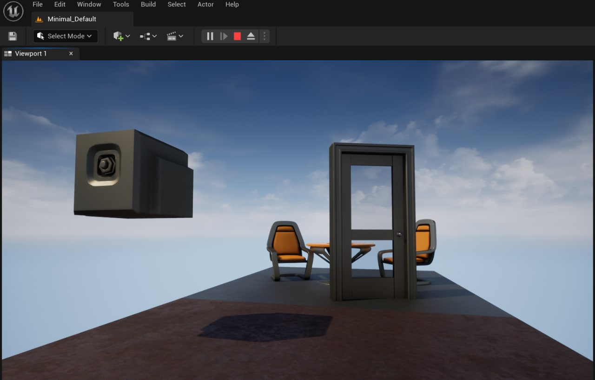

# UE5.0.2 102.1 Intro to Blueprints

Practice:  

Follow along the instructions from the video and create the Blueprints with the following attributes: 

1. Door is animated  

2. Door opens up with the press on the keyboard button when Player is near it 

3. Another Blueprint that locks the Door Blueprint 

4. Door is locked until a switch actor is pressed

## My solution is provided in Content\MyBlueprints folder
