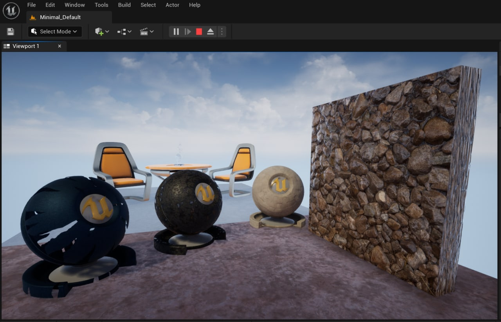

# UE5.0.2 101.1 Materials Production

Practice task: 

Follow along the instructions from the video and create the following Material assets: 

1. A basic Master Material that utilizes the following material inputs: Base Color, Metallic, Roughness, Normal, Ambient Occlusion 

1.1 All values for them should be parametrized 

2. A Material Instance out of it. Change values/textures for all of the available Parameters. Instance should not look the same as the Parent Material 

3. A two-sided Master Material with the Cloth Shading Model that utilizes the following material inputs: Base Color, Opacity Mask, Fuzz Color, Cloth, Metallic, Specular, Roughness, Normal 

4. A Master material with the Panner animation that utilizes the following material inputs: Base Color, Specular, Roughness, Normal, Ambient Occlusion 

## My solution is provided in IntroMat101_1\Content\MyMaterials folder
